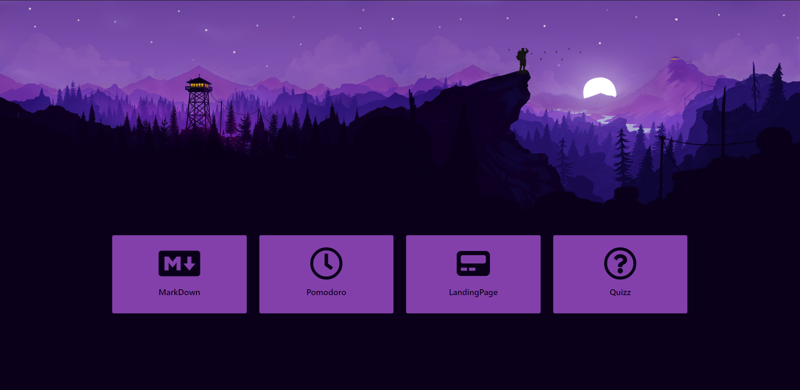
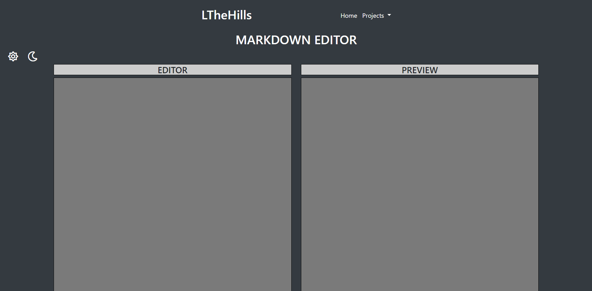
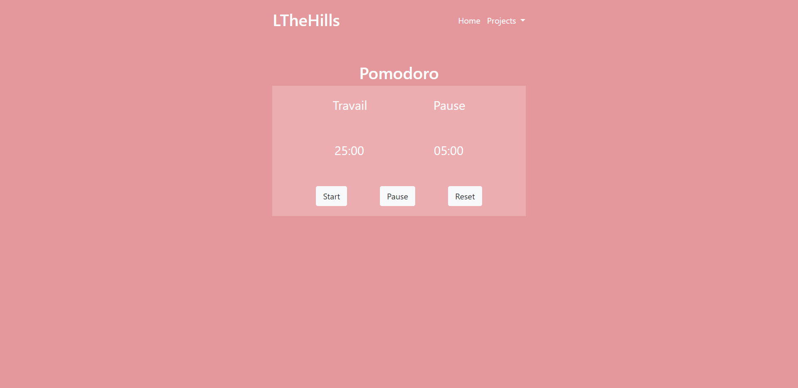
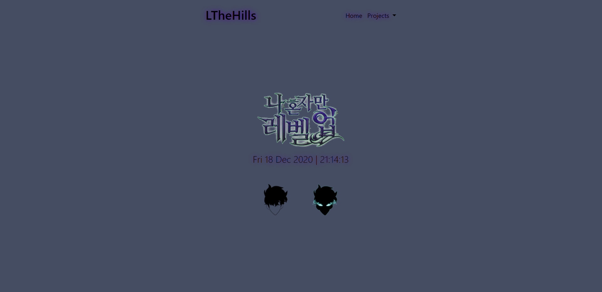

# LeavingTheHills

* [Cemil Ylmaz](https://github.com/Cemil1000)

* 13.11.2020

## What is this ?
4 Projet :
* Cover page
    * One Markdown
    * Pomodoro timer
    * Landing page
    * Quizz

## Purpose?
It is 4 projects with each different challenges. The objectives are to achieve the different challenges with what we learned during our two months of training. One day one project.

## Functionalities
* All is Responsive
* Navbar
* Cover page
* Dark and Light mode on Markdown
* Dynamic hour on landing page

## Languages used?
* HTML
* CSS
    * Bootstrap
* JavaScript

### Original instruction

[Link](https://github.com/becodeorg/bxl-hopper-1-25/tree/master/The%20Hill/projects/99.leaving_the_hills)

## Overview 
[My collection](https://cemil1000.github.io/LeavingTheHills/index.html)

